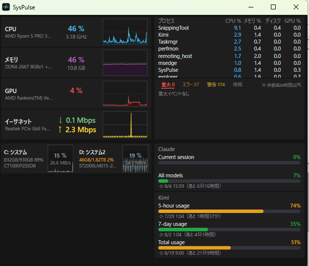

# SysPulsar (C# 移植版)

タスクマネージャー風システムモニター。Python 版の C# 再実装。
仕様の正典は Python 版の PORTING.md(旧ワークスペース
`SysPulse タスクマネージャー開発/SysPulse_python3`)。**管理者権限不要**が最重要方針。



## 構成

- `src/SysPulsar.Core` — 計測ライブラリ。UI 非依存。後の WPF アプリからもこれを参照する
  - `Metrics/` — CPU(GetSystemTimes + PDH)、メモリ(GlobalMemoryStatusEx)、
    ディスク(PDH `\PhysicalDisk(*)\% Disk Time`)、ネット(NIC バイトカウンタ差分)、
    プロセス(TotalProcessorTime 差分 + GetProcessIoCounters +
    PDH `\GPU Engine(*)\Utilization Percentage` を pid 毎に合算)、
    GPU 全体(NVML P/Invoke。AMD/Intel など NVML が使えない環境では
    PDH GPU Engine の全インスタンス合算にフォールバック。温度は NVML のみ)
  - `Pdh/PdhQuery.cs` — PDH ラッパー。`PdhAddEnglishCounter` を使うため
    日本語 Windows でも英語カウンタ名が使える(PerformanceCounter クラスは不可)
  - `DeviceInfo/DeviceInfoProvider.cs` — WMI 系の遅いデバイス名取得。
    **必ずバックグラウンドスレッドから呼ぶ**(Python 版で起動フリーズした経緯あり)
  - `SystemMonitor.cs` — 計測の窓口(facade)
- `src/SysPulsar.Dump` — 検証用 CLI。Python 版の `python syspulse.py --dump` 相当。
  全メトリクスを 1 回 JSON で出力
- `src/SysPulsar.App` — WPF GUI(2x2 レイアウト、スパークライン自前描画、
  ドラッグ/リサイズ中は描画停止)。実行時は `SysPulsar.exe`
  - `Controls/Sparkline.cs` — 履歴 120 サンプル右詰め、塗りつぶし→線の 2 パス描画
  - `Controls/MetricRow.cs` / `Controls/ProcessTable.cs` — メトリクス行 / プロセス表
  - `Controls/DiskRow.cs` — ディスクセル(2 列 x 5 行。背景スパークライン+2 行表示)
  - `Controls/UsagePanel.cs` — AI Usage ゲージ(右下パネル。後述)
  - `Controls/CriticalEventPanel.cs` — システムログイベント件数(右上の下。2行表示)
  - `Usage/` — UsageWatcher から移植した AI 使用量取得(Providers/Poller/Settings/Log)
  - `ExternalTools.cs` — 右クリックメニューから開く外部ツール(後述)
  - `UpdateChecker.cs` — GitHub Releases ベースの自動更新(後述)
  - `config.json` — PC 固有設定(下記)

## レイアウト

```
左上: CPU / メモリ / GPU / イーサネット(負荷・速度・スパークライン)
右上: プロセス表(残り全部) + イベント件数(下・2行ぶん)
左下: ディスク(2 列。背景スパークライン付きセル)
右下: AI Usage(Claude / Kimi の使用量ゲージ)
```

## システムログイベント

右上エリアの下で、イベントビューアーのシステムログの件数を監視する
(60 秒周期のポーリング)。詳細(直近イベントの本文)は表示せず、
「イベント」見出し + レベル別件数の 2 行だけのコンパクト表示とし、
空いた高さをプロセス表に割り当てている。

- 重大 / エラー / 警告 / 情報の 24 時間以内の件数を色分けで並べる
  (重大=赤 / エラー=橙 / 警告=黄 / 情報=グレー。
  `TimeCreated[timediff(@SystemTime) <= 86400000]` で集計)
- System ログは標準ユーザーで読めるため**管理者権限不要**(Security ログは不可)
- 取得失敗時は注記を表示。直近イベントの詳細は右クリックメニューの
  「イベントビューアー (システムログ)」からイベントビューアーで確認する

## 設定(config.json)・状態(window-state.json)

実行ファイルと同じフォルダに置く。終了時にウィンドウの位置・サイズ、
「常に手前に表示」「表示エリア」の状態を `window-state.json` に保存し、
次回起動時に復元する(画面外に保存されていた場合は位置だけ中央に戻す)。

```json
{
  "intervalMs": 1000,
  "namesRefreshSec": 30,
  "disks": [
    { "number": 3, "label": "システム" },
    { "number": 4, "label": "ゲーム" }
  ],
  "kimiApiKey": ""
}
```

- `kimiApiKey`: Kimi Code Console で発行する API キー(sk-...)。
  AI Usage の Kimi 側認証で最優先に使われる(後述)。**git 管理外の実値は
  `publish/config.json` とインストール先にだけ置く**こと(リポジトリの
  `src/SysPulsar.App/config.json` は空のテンプレート)
- `disks` が空 → Online ディスクをドライブレター順に最大 10 台自動検出。
  表示名はドライブレター+ボリュームラベル("C:システム"、複数パーティションの
  物理ディスクは "C:システム F:データ" で並びは先頭レター基準)。
  その下の 2 行目に空き/総量+空き率("833GB/930GB 89%"。1TB 以上の値は
  "46GB/1.82TB" のように TB 表記(10TB 以上は小数 1 桁、それ未満は小数 2 桁)。
  複数パーティションは合算。MSFT_Volume で取得、失敗時は Win32_LogicalDisk)を表示し、
  セルから溢れた分はクリップして隠す。空き率 10% 未満は橙気味の色で警告する。
  レターが 1 つも取れないディスクは従来の「ディスク N」表記にフォールバックし、
  並びも最後尾(番号順)になる
  (レター対応は WMI の MSFT_Partition で取得、失敗時は Win32_LogicalDiskToPartition)
- `disks` を指定 → その順・ラベルで先頭から固定表示。残りの枠は固定以外の
  Online ディスクをドライブレター順に自動追加(USB メモリ等の抜き差しに追従)
- 配置は左下ブロックを 2 列で使用(最大 10 台。左・右・左・右の順)。
  各セルは横幅が狭いため、左半分=表示名/容量/デバイス名の 3 行、
  右半分=スパークラインを背景いっぱいに描き使用率/実速度の 2 行を重ねる
  (数値は半透明プレートの上に表示して視認性を確保)。
  行は常に 4 行以上確保し、8 台以下ならセル高は左下エリアの 1/4、
  9 台以上のときだけ 5 行(1/5)に縮む。空き行は下に余る。
  表示台数の決定ロジックは従来どおり
- ディスクの増減は `namesRefreshSec` 周期(既定 30 秒)で検出して行を作り直す

## AI Usage(UsageWatcher 統合)

右下パネルに Claude / Kimi の AI 使用量ゲージを表示する
(KimiCreditWatcher の UsageWatcher から移植。単体版と同等の取得仕様)。

- **表示**: プロバイダ毎にゲージ(ラベル+% / バー / リセット時刻+カウントダウン)
  - Claude: Current session / All models
  - Kimi: 5-hour usage / 7-day usage / Total usage(取れるものだけ表示)
- **色分け**: 50% 未満=緑、50% 以上=橙、80% 以上=赤(しきい値は設定で変更可)
- **ポーリング**: 120 秒周期(下限 30 秒)をプロバイダ毎にバックグラウンドで実行。
  HTTP 429 は Retry-After(最低 300 秒)でバックオフ。
  通信失敗時は直前の値に「通信失敗のため直前値を表示中」を添えて継続表示
- **認証(読むだけ原則)**: 認証ファイルは読み取り専用で開き、絶対に書き込まない
  (書き込むと本家 CLI のログインが壊れる)
  - Claude: `~/.claude/.credentials.json` の accessToken → `api.anthropic.com/api/oauth/usage`
  - Kimi: 認証は次の優先順で解決 → `api.kimi.com/coding/v1/usages` 等を叩く
    1. `config.json` の `kimiApiKey`(Kimi Code Console で発行。**推奨**)
    2. `~/.kimi-code/config.toml`(無ければ Kimi Work 同梱の config.toml)の
       api_key / base_url(Kimi Work 時代の互換経路)
    3. `~/.kimi-code/credentials/kimi-code.json` の access_token
       (新 Kimi Code CLI の OAuth 認証。15 分で切れるため CLI 使用直後しか
       有効でない。あくまでフォールバック)
    ※ 新 Kimi Code CLI は OAuth 方式のため config.toml の api_key は空。
    リフレッシュは本家 CLI に任せ、こちらからは行わない
    (認証ファイルに書き込むと本家のログインが壊れる恐れがあるため)
  - Kimi の **Total usage**(totalQuota)は agent-gw 系の base_url でしか返らず、
    コンソールキー(scope: FEATURE_CODING)では取れない
    (agent-gw を叩くと 403 api_key_path_forbidden)。
    そのため 1 または 3 が主認証のときも、config.toml に旧キー(Kimi Work 時代、
    scope: FEATURE_WORK)が残っていれば agent-gw を併せて叩き Total usage を補完する。
    旧キー失効時は Total usage だけ自動的に非表示になる
- **設定共有**: `%LOCALAPPDATA%\UsageWatcher\settings.json` を単体版 Watcher と共有
  (しきい値・ポーリング間隔・プロバイダ有効/無効・Claude/Kimi の表示切替)。
  ログも同じフォルダに出る
- ※ 両プロバイダとも非公式 API。スキーマ変更時は UsageWatcher 側と合わせて直す

## 右クリックメニュー(外部ツール起動)

ウィンドウ上のどこでも右クリックすると、関連する Windows の画面を開ける
(すべて管理者権限不要。`ExternalTools.cs`):

- **タスクマネージャー** — `taskmgr.exe`
- **リソース モニター** — `resmon.exe`
- **パフォーマンス モニター** — `perfmon.exe`
- **イベントビューアー (システムログ)** — `eventvwr.exe /c:System`
  (Windows ログ > システムを選択した状態で起動)
- **ディスクの管理** — `diskmgmt.msc`
- **記憶域 (コントロール パネル)** — `control.exe /name Microsoft.StorageSpaces`
- **ネットワーク接続** — `ncpa.cpl`
- **電源オプション** — `powercfg.cpl`
- **音量ミキサー** — `ms-settings:apps-volume`(設定 > システム > サウンド)
- **インストールされているアプリ** — `ms-settings:appsfeatures`(設定 > アプリ)
- **Kimi Console** — `https://www.kimi.com/code/console`(ブラウザ)
- **表示エリア** — サブメニューからレイアウトを 4 種から選択
  (**1×1 (左上のみ)** / **1×2 (上半分のみ)** / **2×1 (左半分のみ)** / **2×2 (すべて)**。
  非表示の行・列は畳まれ、残ったエリアが広がる。ウィンドウサイズ自体は変えないが、
  最小サイズはモードに応じて緩む(1×1: 300x280、1×2: 560x280、2×1: 300x500、
  2×2: 560x500)ので小さいモードではその分小さく畳める
  (2×2 に戻すと最小サイズ未満なら自動で広がる)。
  状態は window-state.json に保存され、終了後も維持される)
- **常に手前に表示** — チェックでウィンドウを常に最前面に表示
  (状態は window-state.json に保存され、終了後も維持される)
- **Claude を表示 / Kimi を表示** — チェックで右下の AI Usage エリアの
  ゲージをプロバイダ個別に表示/非表示(デフォルトは両方表示。
  両方非表示のときは右下エリアを畳み、右上のプロセス+イベント領域を
  縦いっぱいに伸ばす。状態は settings.json に保存され、終了後も維持される)

プロセス表のプロセス名を右クリックすると、その行のプロセスの
**「ファイルの場所を開く」**(explorer /select)が使える
(パスが取れないシステムプロセス等では何も起きない)。

## 自動更新(GitHub Releases)

起動時に `api.github.com/repos/YumT/SysPulse/releases/latest` を確認し、
`SysPulsar.App.csproj` の `<Version>` より新しいタグがあれば
バックグラウンドで zip のダウンロード・`%TEMP%\syspulsar-update\stage` への
展開まで済ませる(`UpdateChecker.cs`)。右クリックメニューの先頭に
「vX.Y.Z に更新」が出るので、クリックすると差し替え bat が
「終了待ち → exe/bat の上書き → 再起動」を行う。

- チェックは起動時のみ(定期ポーリングなし)。失敗時は何も出ない(黙殺)
- **config.json / window-state.json は上書きしない**(stage から config.json を除去)
- ダウンロードした zip は `<zip名>.sha256` アセットと SHA256 照合する。
  ハッシュ アセットが無い・不一致のリリースには更新しない(fail closed)
- リリースを出すときは **csproj の `<Version>` をタグと一致させてから**
  ビルド・publish すること(一致していないと更新が無限に提示される)。
  また zip と一緒に `<zip名>.sha256`(`<ハッシュ>  <ファイル名>` 形式)を
  アセットに添付すること(無いと更新が適用されない)

## 常駐動作(タスクトレイ)

- **多重起動禁止**: 2 個目を起動しても既存ウィンドウが復帰するだけ(単一インスタンス)
- **ウィンドウ枠のテーマ**: タイトルバーなどのウィンドウ枠は OS のアプリテーマ
  (ライト/ダーク)に追従(DWM の DWMWA_USE_IMMERSIVE_DARK_MODE。
  OS のテーマ変更時も WM_SETTINGCHANGE で即時反映。本体 UI は常にダークのまま)
- **最小化 / ×ボタン** → ウィンドウは閉じずタスクトレイへ退避(常駐継続)
- **トレイアイコン ダブルクリック / メニュー「開く」** → ウィンドウ復帰
- **トレイメニュー「終了」** → 完全終了
- 初回起動後、トレイアイコンは Windows のオーバーフロー(^)に隠れることがある。
  常時表示したい場合はトレイ設定でピン留めする

## ビルド

```sh
./build.sh              # Debug
./build.sh -c Release   # Release
```

Visual Studio から開く場合は通常の環境変数が揃っているためそのままビルド可能。

## 配布・インストール

```sh
# 自己完結 single-file(.NET ランタイム不要、約 65MB)を publish/ に生成
dotnet publish src/SysPulsar.App -c Release -r win-x64 --self-contained true \
  -p:PublishSingleFile=true -p:IncludeNativeLibrariesForSelfExtract=true \
  -p:EnableCompressionInSingleFile=true -o publish

# %LOCALAPPDATA%\Programs\SysPulsar にコピーし、スタートアップに SysPulsar.lnk を作成
# (Windows ログオン時に自動起動。削除はショートカットを消すだけ)
powershell -ExecutionPolicy Bypass -File install.ps1
```

配布(zip 同梱)向けには、exe と同じフォルダで実行する自動起動の登録/解除 bat を
用意している(どちらもスタートアップフォルダの `SysPulsar.lnk` を作成/削除するだけ。
管理者権限不要):

- `autostart-register.bat` — 登録(同じフォルダの SysPulsar.exe をログオン時に起動)
- `autostart-unregister.bat` — 解除

## 動作確認

```sh
./src/SysPulsar.Dump/bin/Debug/net10.0-windows/SysPulsar.Dump.exe   # 計測のみ
./src/SysPulsar.App/bin/Release/net10.0-windows/SysPulsar.exe       # GUI
```

初回サンプルはレート系(CPU/ネット/ディスク)が計算できないため内部で捨て、
1 秒後の 2 回目を出力する。

## 実機での検証結果(2026-07-28)

- CPU 名 / 定格クロック / メモリ構成 / NIC 名 / ディスクモデルを正しく取得
- GPU は NVML 非対応の内蔵 GPU の環境で PDH GPU Engine 合算にフォールバックし
  負荷を表示(温度は NVML のみのため非表示)
- MSFT_Disk の Online 判定で切断済みディスクを除外
- GUI 常駐計測(Release): **CPU 約 0.3〜0.6%**(typeperf 全コア合計の 2.3〜4.7% ÷ 8 スレッド)、
  ワーキングセット 約 113〜128MB(Python 版 5% から大幅改善。メモリは今後の削減余地あり)

## 温度表示の検証結果(2026-07-28、非管理者で実測)

「権限不要」方針での温度取得は**不可**と確定。試した全経路と結果:

- CPU 温度: WMI `MSAcpi_ThermalZoneTemperature` → 検証機は Not supported
- ディスク温度(WMI): `MSFT_StorageReliabilityCounter` / `MSStorageDriver_FailurePredictData`
  → どちらも Access denied(要管理者)
- ディスク温度(NVMe PoC): `IOCTL_STORAGE_QUERY_PROPERTY` の全バリエーション
  (素の StorageDeviceTemperatureProperty(21)、NVMe プロトコル固有(18/19)、
  物理ディスク/ボリューム(C:/D:)両経路)を実装して検証
  → `GENERIC_READ` でのデバイスオープンは標準ユーザーに拒否(err=5)、
  アクセス権 0 のハンドルでは全 IOCTL が err=1(INVALID_FUNCTION)
  → **Windows のセキュリティモデル上、非管理者での SMART/温度取得は不可能**
- メモリ温度: DIMM センサー読み出し自体にドライバ+管理者権限が必要

温度を表示する唯一の現実的経路は LibreHardwareMonitor + 管理者権限
(Python 版で撤去した判断と同じ結論)。GPU 温度のみ NVML 経由で NVIDIA 搭載時は表示可能。

## 今後の候補

- メモリ使用量の削減検討(自己完結版は WS 約 240MB)
